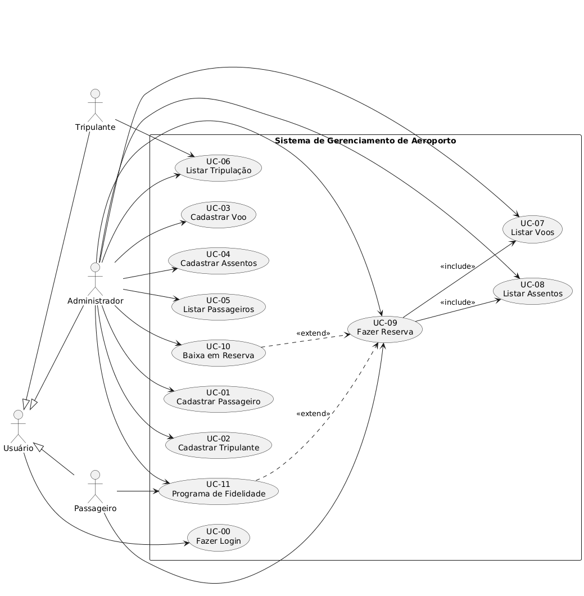
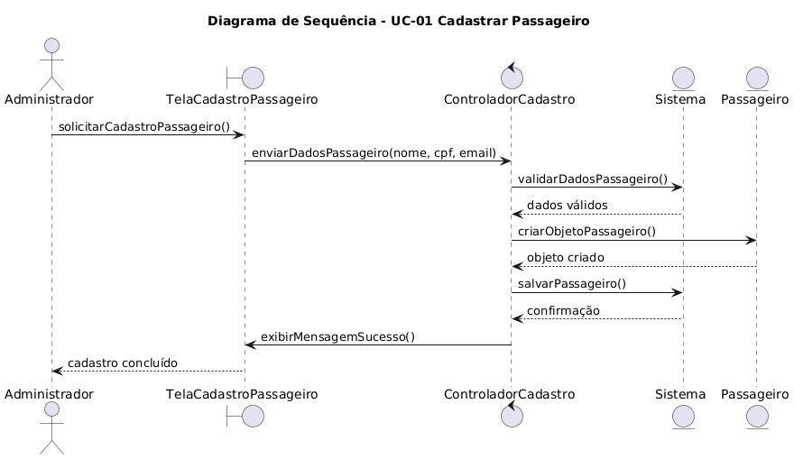
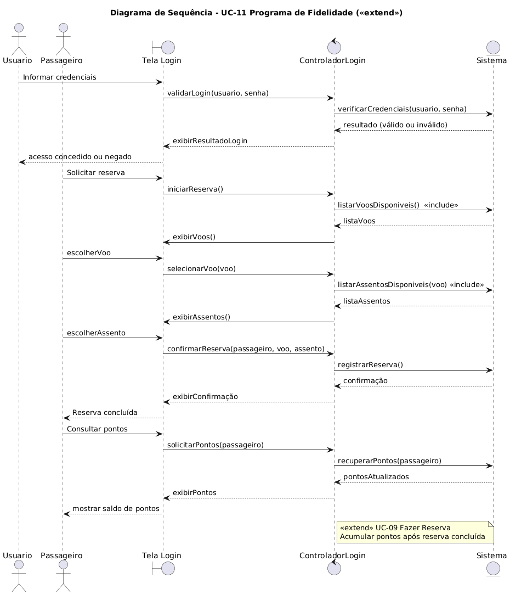
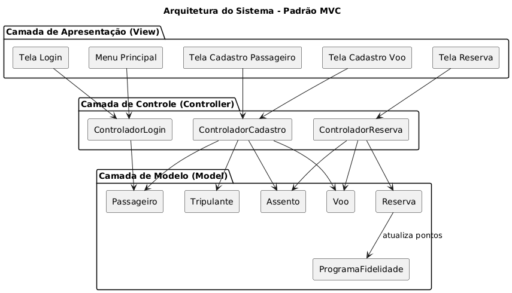

# Trabalho_final_PS
# Aerohub ✈️

## 📌 Descrição
Este projeto implementa um sistema simples para gerenciamento de operações em um aeroporto, utilizando **Java** e o padrão arquitetural **MVC**. O sistema permite cadastrar passageiros, tripulantes, voos e assentos, além de realizar reservas e gerenciar um programa de fidelidade.

---

## ✅ Funcionalidades
- **Cadastrar Passageiro**
- **Cadastrar Tripulante**
- **Cadastrar Voo**
- **Cadastrar Assentos**
- **Listar Passageiros**
- **Listar Tripulação**
- **Listar Voos**
- **Listar Assentos**
- **Fazer Reserva**
- **Baixa em Reserva**
- **Programa de Fidelidade**
- **Login no Sistema**

---

## 🏗 Arquitetura
O sistema foi desenvolvido seguindo o padrão **MVC**:
- **Model**: Classes `Passageiro`, `Tripulante`, `Voo`, `Assento`, `Reserva`, `ProgramaFidelidade`.
- **View**: Interface via console com menus interativos.
- **Controller**: Controladores para login, cadastro e reservas.

---

## 📊 Diagramas UML

### **Diagrama de Casos de Uso**
Representa os atores (Usuário, Administrador, Passageiro, Tripulante) e suas interações com os casos de uso do sistema.


---

### **Diagramas de Sequência**
Mostram o fluxo de mensagens entre os objetos para realizar operações específicas.

- **UC-01 Cadastrar Passageiro**


- **UC-09 Cadastrar VÔOS**


- **UC-11 Programa de Fidelidade**


---

### **Diagrama de Comunicação**
Mostra os objetos envolvidos e as mensagens trocadas para os principais casos de uso.


---

### **Diagrama de Arquitetura (MVC)**
Exibe a estrutura do sistema baseada no padrão MVC.


---

### **Diagrama de Componentes e Implantação**
Mostra os componentes do sistema e sua alocação nos nós de execução.


---

### **Diagrama de Estados**
Representa o ciclo de vida de uma reserva, desde a criação até a conclusão ou cancelamento.


---

## ⚙️ Pré-requisitos
- **Java 17+**
- IDE (Eclipse, IntelliJ ou VS Code)
- PlantUML (para gerar os diagramas)

---

## ▶️ Como Executar
1. Clone este repositório:
   ```bash
   git clone https://github.com/seuusuario/sistema-aeroporto.git
